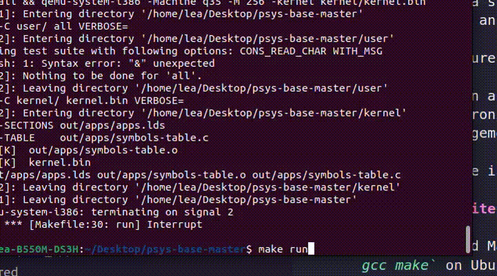

# NebuleaOS

NebuleaOS is a school project where the goal is to create the kernel of an operating system on a x86 architecture from scratch.
The main features of this operating system are :

* The creation and execution of processes
* Their synchronisation and scheduling
* Memory management and he separation of user space and kernel space
* Handling the input (keyboard) and output (screen)



## Pre-requisites

1. Any GCC and Make for the compilation (`sudo apt install gcc make` on Ubuntu)
2. qemu-system-x86 package for the execution in an emulator (`sudo apt install qemu-system-x86` on Ubuntu)

## Usage and cleaning up

Run the following command to compile and execute the program:

```bash
make run
```

If you want to clean up the compiled executables and object files, you can use:

```bash
make clean
```

## Running the OS on a USB stick

It is also possible to test the OS on a real PC through the Grub loader. 

A few warnings ⚠️ :
* You probably shouldn't attempt this on a PC that has anything you value in it.
* I am not responsible if this completely fucks up your PC and bricks it.
* This is uncharted territory : I don't know what happens if the OS segfaults or panics while being the main OS.
* This only works on USB sticks that have a partition table. You can check this by using the `mount` command and checking if the partition has a number (for example `/dev/sdb1`)

Here are the steps :
1. Change the partition table to GPT.
2. Create a fat32 partition and put the `kernel.bin` in the root of the partition .
3. Connect the USB stick to the PC and reboot.
4. While choosing the OS, press the `c` key to open the Grub console.
5. Localise the partition using `ls` (usually `(hd1, gpt1)`)
6. Input `multiboot (hd1, gpt1)/kernel.bin`.
7. Input `boot`.
8. Done !


## Understanding the code

This project is divided in two folders that each represent the kernel side and the user side.

### Kernel

The kernel's role is to start up the operating system, and to implement syscalls to allow the userside to interact with the OS. 

#### kernel environnement

The OS starts with the execution of the `boot/crt0.S` file. It sets up the basic execution environment by configuring the stack, clearing interrupts, and initializing the multiboot information. It includes a multiboot header for compatibility, sets up paging, and eventually transfers control to the kernel's main boot function. It also defines weak symbols for unimplemented functions, allowing for overrides in C files.

`crt0.S` then calls the `boot` function in the `boot/boot.c` file, which saves the multiboot context, clears free memory, initializes CPU structures, sets up and enables paging, and then calls the main kernel start function, called `kernel_start` and defined in `start.c`.

The `kernel_start` function sets up the memory free list, screen, interrupt handlers, and clock frequency. It creates and starts the idle and initial user processes (`autotest` by default), configures the Task State Segment (TSS), unmasks necessary hardware interrupts, and enters an infinite loop to maintain kernel control, triggering a panic if the idle process returns.

#### kernel interruptions

The different processes are allowed a fixed amount of time to execute : 12.5ms. This is done by a timer interruption that happens every 2.5ms, which switches the context from user space to kernel space. These interruptions work by modifying the entry number 32 in the IVT (Interrupt Vector Table) and setting up a function that saves the important registers and calls the `tic_PIT` function in `time.c`.

The user space also needs to talk to the kernel though software interruptions. We have made the decision to arbitrarly set the syscall entry number in the IVT to 49. 

In order to call these syscalls, we need to find a way to pass parameters to the syscall. This is done by setting the registers values to the parameters value. `EAX` is used to know which syscall is called. The enum of all the syscall numbers are in the `shared/syscall_nums.h`. The parameters are put in the registers in this order : `EBX`, `ECX`, `EDX`, `ESI`, `EDI`.

### User

#### Syscalls

The `lib/syscall_user.c` file defines the `__syscall` function, which takes a syscall number (defined in `shared/syscall_nums.h`) and at most 5 other parameters, and put them in a list. This list is then passed as a parameter to the `__do_interruption` function defined in `do_interruption.S`, the elements of the list are put in the registers, and the instruction `int $49` triggers the syscall and switches the context to kernel space.

#### Tests

The tests are simply user programs that contain asserts regularly to make sure the OS and the syscalls work as intended. User programs are compiled in a specific way that forces them to have their entry point start at the 1 Go memory address, and their stack to be stored at the 3 Go memory address.

Currently, not all the tests work, but let's call it a work in progress.

## Contributing

Contributions to optimize algorithms, improve documentation, or add new features are welcome! Please open issues or submit pull requests.